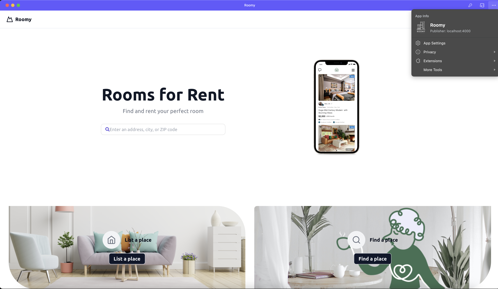
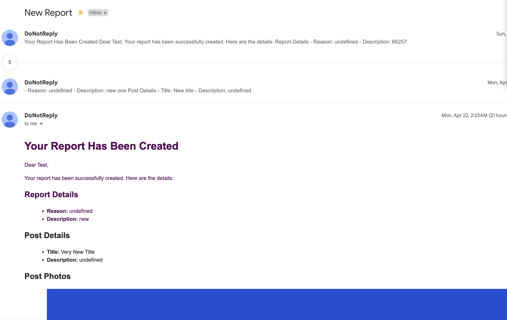

**Roomy**

## Quick start

- Clone the repo
- Make sure your Node.js and npm versions are up to date
- Start the Node.js server: `cd service && npm i && npm run start`
  - The server needs .env file
- Start the Admin Panel: `cd admin-portal && npm i && npm run dev -- -p 8080`
- Start the User Client: `cd roomy-client && npm i && npm run dev -- -p 4000`
- Both the admin panel and user client are PROGRESSIVE WEB APPS and can be installed on your device
- Video Demo: [Link](https://drive.google.com/file/d/1q_uOL25AXGmxvbhGtv3JoO7TlS3n--_U/view?pli=1)

## File Structure
- `service/` contains the backend server
  - `Node.js/Express.js/MongoDB`
- `admin-portal/` contains the admin portal
  - `Next.js/React.js`
- `roomy-client/` contains the user client
  - `Next.js/React.js`

Project Overview -

Problem :
Young immigrants coming to the US for studies face a unique challenge: finding compatible roommates. Existing platforms focus on renting entire apartments, making it difficult to connect with potential roommates

Roomy’s solution : 
Effortless Roommate Matching. Forget endless scrolling and awkward meetups. Roomy connects you with compatible roommates who already have a place, making finding a perfect living situation a breeze......can you add this to read me ?

The Room Booking System is a web-based platform designed to facilitate the easy listing and booking of accommodations. Users can create listings for their available spaces, browse and contact postings, and process transactions securely. This application aims to streamline the process of finding short-term rentals for users by providing a user-friendly interface and a robust backend.

# Object Model

## Model for the application

### ER Diagram

```mermaid
erDiagram
    User {
        string Name
        string Email
        string Address
        string HashedPassword
        string Salt
    }
    Posting {
        string StreetAddress
        string UnitNo
        string City
        string StateCode(2)  
        string ZipCode(10)   
        string PhoneNumber      
        datetime startDateRange
        datetime endDateRange   
        decimal Price        
        string[] Photos     
        string NearbyPlaces  
        string HomeType      
        string[] Utilities   
        string[] Amenities   
        string FoodPreference 
        string UserID        
    }
    Admin {
        string Name
        string Email
        string HashedPassword
        string Salt
    }
    Payment {
        string TransactionID
        string Amount
        string Status
        string UserID
        string PostingID
    }
    Report {
        string ReportID
        string Description
        string UserID
        string PostingID
        string Status
    }
    ContactedPosting {
        string ContactID
        datetime ContactDate
        string UserID
        string PostingID
    }
    User ||--o{ Posting : "Creates"
    Posting }|--|| Admin : "Managed By"
    User }|--o{ Payment : "Makes"
    User }|--o{ Report : "Submits"
    Admin }|--o{ Report : "Handles"
    User }|--o{ ContactedPosting : "Contacts"
    Posting }|--o{ ContactedPosting : "Contacted By"

```

### Class Diagram

```mermaid
classDiagram
    class User {
        - string Name
        - string Email
        - string Address
        - string HashedPassword
        - string Salt
    }
    class Posting {
        - string StreetAddress
        - string UnitNo
        - string City
        - string StateCode
        - string ZipCode
        - string PhoneNumber
        - datetime startDateRange
        - datetime endDateRange
        - decimal Price
        - string[] Photos
        - string NearbyPlaces
        - string HomeType
        - string[] Utilities
        - string[] Amenities
        - string FoodPreference
        - string UserID
    }
    class Admin {
        - string Name
        - string Email
        - string HashedPassword
        - string Salt
    }
    class Payment {
        - string TransactionID
        - string Amount
        - string Status
        - string UserID
        - string PostingID
    }
    class Report {
        - string ReportID
        - string Description
        - string UserID
        - string PostingID
        - string Status
    }
    class ContactedPosting {
        - string ContactID
        - datetime ContactDate
        - string UserID
        - string PostingID
    }

    User "1" -- "0..*" Posting : Creates
    Posting "1" -- "0..1" Admin : Managed By
    User "1" -- "0..*" Payment : Makes
    User "1" -- "0..*" Report : Submits
    Admin "1" -- "0..*" Report : Handles
    User "1" -- "0..*" ContactedPosting : Contacts
    Posting "1" -- "0..*" ContactedPosting : Contacted By

```
    
    
    
    
    
